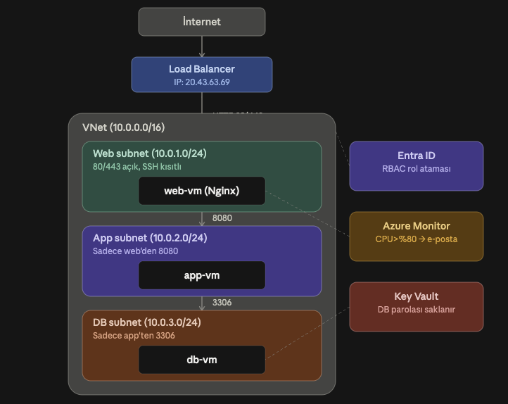
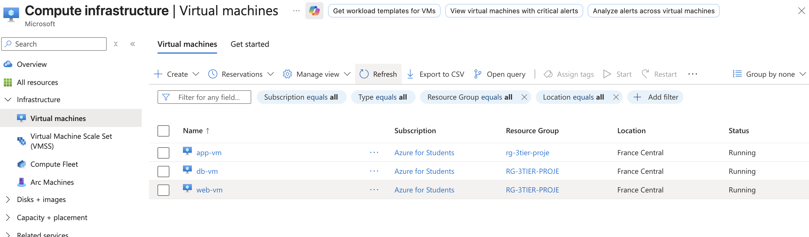

# Azure Secure 3-Tier Infrastructure

[Türkçe](README.tr.md)

A hands-on project to build a real-world company infrastructure on Azure manually 
(Portal + Azure CLI), with the goal of understanding how Azure resources are 
provisioned and connected before moving to Terraform.

## Architecture Overview

A 3-tier web application architecture was built:
- **Web tier** (public) → Load Balancer + VM running Nginx
- **Application tier** (private) → VM reachable only from the web tier
- **Database tier** (private) → VM reachable only from the application tier

The architecture diagram above visualizes the traffic flow: Internet → Load Balancer → 
Web subnet → App subnet → DB subnet.

## Network Diagram — Subnets and NSG Rules

| Subnet | IP Range | Resource | NSG Rule |
|---|---|---|---|
| snet-web | 10.0.1.0/24 | Load Balancer + web-vm (Nginx) | Ports 80/443 open from the internet; SSH (22) restricted to the admin's IP only |
| snet-app | 10.0.2.0/24 | app-vm | Only port 8080 allowed, and only from 10.0.1.0/24 (web subnet) |
| snet-db | 10.0.3.0/24 | db-vm | Only port 3306 allowed, and only from 10.0.2.0/24 (app subnet) |

**Nginx — accessed via web-vm**


VNet: `10.0.0.0/16`, region: `francecentral`

Each subnet has its own Network Security Group; all inbound traffic is denied by 
default, and only the rules above explicitly allow traffic through.

## Security Decisions

**Why private subnets (App/DB have no public IP)?**  
If the application and database tiers were directly reachable from the internet, the 
attack surface would be much larger. These VMs were never given a public IP — they're 
only reachable from within the VNet (via the web tier). This is a basic application of 
the "defense in depth" principle commonly used in real production environments.

**Why Key Vault?**  
Instead of storing the database password in plaintext inside a file or environment 
variable on the VM, it's stored centrally and encrypted in Key Vault. db-vm uses Azure 
**Managed Identity** to fetch this secret at runtime — without ever having a password or 
key written to the VM itself. This means the password never sits in plaintext anywhere, 
access is governed by RBAC, and every access can be audited on the Azure side.

**Why is SSH restricted to a single IP?**  
Leaving the SSH (22) port open to the entire internet is one of the most common security 
mistakes — bots continuously scan for open port 22 and attempt brute-force password 
guesses. In this project, SSH access is restricted to the developer's own IP address only.

**Why does RBAC matter?**  
Roles were assigned on the resource group and Key Vault following the principle of least 
privilege — for example, a general user was only granted "Reader" (read-only) access, 
while the VM's identity was granted only "Key Vault Secrets User" (read-only secret 
access). No resource was given more permission than it actually needed.


## Screenshots

**Nginx — accessed via web-vm**


**Virtual machines overview**


**All resources in the resource group**


## Deployment Steps (Command by Command)

### 1. Prerequisites
```bash
brew install azure-cli
az login
```

### 2. Resource Group and VNet
```bash
az group create --name rg-3tier-proje --location francecentral

az network vnet create \
  --resource-group rg-3tier-proje \
  --name vnet-3tier \
  --address-prefix 10.0.0.0/16 \
  --subnet-name snet-web \
  --subnet-prefix 10.0.1.0/24 \
  --location francecentral

az network vnet subnet create \
  --resource-group rg-3tier-proje \
  --vnet-name vnet-3tier \
  --name snet-app \
  --address-prefix 10.0.2.0/24

az network vnet subnet create \
  --resource-group rg-3tier-proje \
  --vnet-name vnet-3tier \
  --name snet-db \
  --address-prefix 10.0.3.0/24
```

### 3. NSGs and Rules
```bash
az network nsg create --resource-group rg-3tier-proje --name nsg-web --location francecentral
az network nsg create --resource-group rg-3tier-proje --name nsg-app --location francecentral
az network nsg create --resource-group rg-3tier-proje --name nsg-db --location francecentral

az network nsg rule create \
  --resource-group rg-3tier-proje --nsg-name nsg-web --name Allow-HTTP-HTTPS \
  --priority 100 --direction Inbound --access Allow --protocol Tcp \
  --source-address-prefixes Internet --source-port-ranges '*' \
  --destination-address-prefixes '*' --destination-port-ranges 80 443

az network nsg rule create \
  --resource-group rg-3tier-proje --nsg-name nsg-app --name Allow-From-Web \
  --priority 100 --direction Inbound --access Allow --protocol Tcp \
  --source-address-prefixes 10.0.1.0/24 --source-port-ranges '*' \
  --destination-address-prefixes '*' --destination-port-ranges 8080

az network nsg rule create \
  --resource-group rg-3tier-proje --nsg-name nsg-db --name Allow-From-App \
  --priority 100 --direction Inbound --access Allow --protocol Tcp \
  --source-address-prefixes 10.0.2.0/24 --source-port-ranges '*' \
  --destination-address-prefixes '*' --destination-port-ranges 3306

az network vnet subnet update --resource-group rg-3tier-proje --vnet-name vnet-3tier --name snet-web --network-security-group nsg-web
az network vnet subnet update --resource-group rg-3tier-proje --vnet-name vnet-3tier --name snet-app --network-security-group nsg-app
az network vnet subnet update --resource-group rg-3tier-proje --vnet-name vnet-3tier --name snet-db --network-security-group nsg-db
```

### 4. Virtual Machines
```bash
ssh-keygen -t rsa -b 4096 -f ~/.ssh/azure-3tier-key -N ""

az vm create --resource-group rg-3tier-proje --name web-vm --image Ubuntu2204 \
  --size Standard_B1s --vnet-name vnet-3tier --subnet snet-web \
  --admin-username azureuser --ssh-key-values ~/.ssh/azure-3tier-key.pub \
  --public-ip-sku Standard --location francecentral

az vm create --resource-group rg-3tier-proje --name app-vm --image Ubuntu2204 \
  --size Standard_B1s --vnet-name vnet-3tier --subnet snet-app \
  --admin-username azureuser --ssh-key-values ~/.ssh/azure-3tier-key.pub \
  --public-ip-address "" --location francecentral

az vm create --resource-group rg-3tier-proje --name db-vm --image Ubuntu2204 \
  --size Standard_B1s --vnet-name vnet-3tier --subnet snet-db \
  --admin-username azureuser --ssh-key-values ~/.ssh/azure-3tier-key.pub \
  --public-ip-address "" --location francecentral
```

**Note:** `az vm create` automatically creates a separate NIC-level NSG for each VM; 
this was removed since it conflicted with the subnet-level NSGs:
```bash
az network nic update --resource-group rg-3tier-proje --name web-vmVMNic --remove networkSecurityGroup
az network nic update --resource-group rg-3tier-proje --name app-vmVMNic --remove networkSecurityGroup
az network nic update --resource-group rg-3tier-proje --name db-vmVMNic --remove networkSecurityGroup
```

### 5. Installing Nginx (inside web-vm)
```bash
ssh -i ~/.ssh/azure-3tier-key azureuser@<web-vm-public-ip>
sudo apt update
sudo apt install -y nginx
```

### 6. Load Balancer
```bash
az network public-ip create --resource-group rg-3tier-proje --name pip-lb \
  --sku Standard --allocation-method Static --location francecentral

az network lb create --resource-group rg-3tier-proje --name lb-web --sku Standard \
  --public-ip-address pip-lb --frontend-ip-name feip-web --backend-pool-name beap-web \
  --location francecentral

az network lb probe create --resource-group rg-3tier-proje --lb-name lb-web \
  --name probe-http --protocol Http --port 80 --path /

az network lb rule create --resource-group rg-3tier-proje --lb-name lb-web \
  --name rule-http --protocol Tcp --frontend-port 80 --backend-port 80 \
  --frontend-ip-name feip-web --backend-pool-name beap-web --probe-name probe-http

az network nic ip-config address-pool add --resource-group rg-3tier-proje \
  --nic-name web-vmVMNic --ip-config-name ipconfigweb-vm \
  --lb-name lb-web --address-pool beap-web
```

### 7. Entra ID / RBAC
```bash
az role assignment create \
  --assignee <user-email> --role "Reader" \
  --scope /subscriptions/<subscription-id>/resourceGroups/rg-3tier-proje
```

### 8. Key Vault
```bash
az provider register --namespace Microsoft.KeyVault

az keyvault create --resource-group rg-3tier-proje --name <unique-kv-name> --location francecentral

az role assignment create \
  --assignee <user-email> --role "Key Vault Secrets Officer" \
  --scope /subscriptions/<subscription-id>/resourceGroups/rg-3tier-proje/providers/Microsoft.KeyVault/vaults/<kv-name>

az keyvault secret set --vault-name <kv-name> --name db-admin-password --value '<strong-password>'

az vm identity assign --resource-group rg-3tier-proje --name db-vm

DB_VM_IDENTITY=$(az vm identity show --resource-group rg-3tier-proje --name db-vm --query principalId -o tsv)

az role assignment create \
  --assignee-object-id $DB_VM_IDENTITY --assignee-principal-type ServicePrincipal \
  --role "Key Vault Secrets User" \
  --scope /subscriptions/<subscription-id>/resourceGroups/rg-3tier-proje/providers/Microsoft.KeyVault/vaults/<kv-name>
```

**Fetching the secret from inside db-vm (passwordless, via Managed Identity):**
```bash
TOKEN=$(curl -s -H Metadata:true "http://169.254.169.254/metadata/identity/oauth2/token?api-version=2018-02-01&resource=https://vault.azure.net" | python3 -c "import sys, json; print(json.load(sys.stdin)['access_token'])")

curl -s -H "Authorization: Bearer $TOKEN" "https://<kv-name>.vault.azure.net/secrets/db-admin-password?api-version=7.4" | python3 -m json.tool
```

### 9. Azure Monitor Alert
```bash
az monitor action-group create --resource-group rg-3tier-proje --name ag-email-alert \
  --short-name emailalert --action email admin <user-email>

WEB_VM_ID=$(az vm show --resource-group rg-3tier-proje --name web-vm --query id -o tsv)

az monitor metrics alert create --resource-group rg-3tier-proje --name alert-web-cpu-high \
  --scopes $WEB_VM_ID --condition "avg Percentage CPU > 80" \
  --description "Triggers when Web VM CPU usage exceeds 80%" \
  --evaluation-frequency 5m --window-size 5m --severity 2 --action ag-email-alert
```

## Verification Tests

- Browsing to `http://<web-vm-public-ip>` → the default Nginx page loaded ✅
- Browsing to `http://<lb-public-ip>` → the same page loaded via the Load Balancer ✅
- Direct SSH from the internet to `app-vm`/`db-vm` → not possible (no public IP) ✅
- SSH from `web-vm` to `app-vm` → network connection succeeds (NSG rules work correctly) ✅
- Requesting a secret from Key Vault from inside `db-vm` via Managed Identity → 
  succeeded, with the password never stored in plaintext anywhere ✅

## Estimated Monthly Cost

| Resource | Estimated Cost |
|---|---|
| 3x Standard_B1s VM | ~$22/mo (~$7-8 each) |
| Standard Load Balancer | ~$18/mo (fixed fee) |
| 2x Standard Public IP | ~$7/mo |
| Key Vault | Nearly free (very low per-operation cost) |
| Azure Monitor (up to 10 alerts) | Free |
| **Total** | **~$50-55/mo** |

This project was tested using an **Azure for Students** credit ($100, no credit card 
required) — no real payment was made.

## Technologies Used

- Azure CLI 2.90.0
- Ubuntu 22.04 LTS
- Nginx
- Azure VNet, NSG, Load Balancer, Key Vault, Entra ID, Azure Monitor
