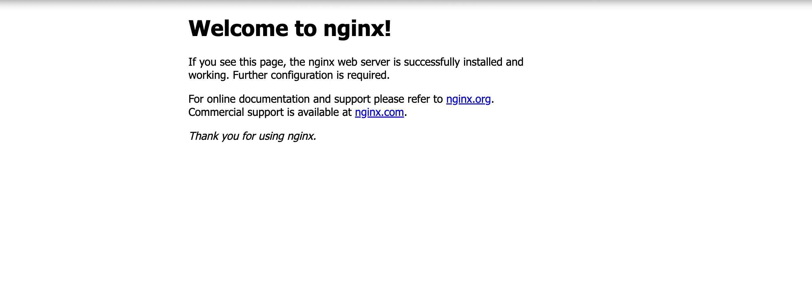
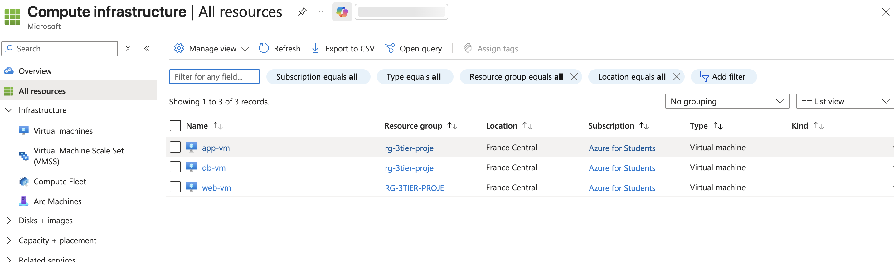

# Azure Secure 3-Tier Infrastructure

Bir şirket altyapısını Azure üzerinde elle (Portal + Azure CLI) kurma projesi. 
Terraform kullanılmadan önce Azure kaynaklarının elle nasıl kurulduğunu ve birbirine 
nasıl bağlandığını anlamak amacıyla yapılmıştır.

## Mimari Özeti

3 katmanlı bir web uygulaması mimarisi kuruldu:
- **Web katmanı** (public) → Load Balancer + Nginx çalışan VM
- **Uygulama katmanı** (private) → sadece Web katmanından erişilebilen VM
- **Veritabanı katmanı** (private) → sadece Uygulama katmanından erişilebilen VM

Mimari diyagramı yukarıda görselleştirilmiştir (trafik akışı: İnternet → Load Balancer → 
Web subnet → App subnet → DB subnet).

## Network Diyagramı — Subnet ve NSG Kuralları

| Subnet | IP Aralığı | İçindeki Kaynak | NSG Kuralı |
|---|---|---|---|
| snet-web | 10.0.1.0/24 | Load Balancer + web-vm (Nginx) | İnternetten 80/443 açık; SSH (22) sadece belirtilen admin IP'sinden |
| snet-app | 10.0.2.0/24 | app-vm | Sadece 10.0.1.0/24'ten (web subnet) 8080 portuna izin |
| snet-db | 10.0.3.0/24 | db-vm | Sadece 10.0.2.0/24'ten (app subnet) 3306 portuna izin |


VNet: `10.0.0.0/16`, bölge: `francecentral`

Her subnet'in kendi Network Security Group'u var; varsayılan olarak tüm inbound trafik 
reddedilir, sadece yukarıdaki kurallarla açıkça izin verilenler geçer.

## Güvenlik Kararları

**Neden private subnet (App/DB'nin public IP'si yok)?**  
Uygulama ve veritabanı katmanları internetten doğrudan erişilebilir olursa saldırı yüzeyi 
büyür. Bu VM'lere hiç public IP verilmedi; sadece VNet içinden (web katmanı üzerinden) 
erişilebiliyorlar. Bu, gerçek şirket ortamlarında yaygın kullanılan "defense in depth" 
(katmanlı savunma) prensibinin temel uygulamasıdır.

**Neden Key Vault?**  
Veritabanı şifresini VM içinde bir dosyada veya ortam değişkeninde düz metin olarak 
saklamak yerine Key Vault'ta merkezi ve şifreli şekilde saklıyoruz. db-vm, Azure 
**Managed Identity** kullanarak (hiçbir şifre/anahtar VM içine yazılmadan) bu secret'ı 
çalışma zamanında çekiyor. Bu sayede şifre hiçbir yerde açık metin olarak durmuyor, 
erişim RBAC ile denetleniyor ve tüm erişimler Azure tarafında loglanabiliyor.

**Neden SSH sadece belirli bir IP'den açık?**  
SSH (22) portunu tüm internete açık bırakmak, botların sürekli brute-force şifre denemesi 
yaptığı en sık yapılan güvenlik hatalarından biridir. Bu projede SSH sadece geliştiricinin 
kendi IP adresinden erişilebilir şekilde kısıtlandı.

**RBAC neden önemli?**  
Kaynak grubu ve Key Vault üzerinde en az yetki (least privilege) prensibiyle roller 
atandı — örneğin genel bir kullanıcıya sadece "Reader" (salt okunur), VM'in kimliğine 
ise sadece "Key Vault Secrets User" (sadece okuma) yetkisi verildi. Hiçbir kaynağa 
gereğinden fazla yetki tanınmadı.


## Ekran Görüntüleri

**Nginx — web-vm üzerinden erişim**



**Sanal makinelerin genel görünümü**


**Kaynak grubundaki tüm kaynaklar**



## Deployment Adımları (Komut Komut)

### 1. Ön Hazırlık
```bash
brew install azure-cli
az login
```

### 2. Kaynak Grubu ve VNet
```bash
az group create --name rg-3tier-proje --location francecentral

az network vnet create \
  --resource-group rg-3tier-proje \
  --name vnet-3tier \
  --address-prefix 10.0.0.0/16 \
  --subnet-name snet-web \
  --subnet-prefix 10.0.1.0/24 \
  --location francecentral

az network vnet subnet create \
  --resource-group rg-3tier-proje \
  --vnet-name vnet-3tier \
  --name snet-app \
  --address-prefix 10.0.2.0/24

az network vnet subnet create \
  --resource-group rg-3tier-proje \
  --vnet-name vnet-3tier \
  --name snet-db \
  --address-prefix 10.0.3.0/24
```

### 3. NSG'ler ve Kurallar
```bash
az network nsg create --resource-group rg-3tier-proje --name nsg-web --location francecentral
az network nsg create --resource-group rg-3tier-proje --name nsg-app --location francecentral
az network nsg create --resource-group rg-3tier-proje --name nsg-db --location francecentral

az network nsg rule create \
  --resource-group rg-3tier-proje --nsg-name nsg-web --name Allow-HTTP-HTTPS \
  --priority 100 --direction Inbound --access Allow --protocol Tcp \
  --source-address-prefixes Internet --source-port-ranges '*' \
  --destination-address-prefixes '*' --destination-port-ranges 80 443

az network nsg rule create \
  --resource-group rg-3tier-proje --nsg-name nsg-app --name Allow-From-Web \
  --priority 100 --direction Inbound --access Allow --protocol Tcp \
  --source-address-prefixes 10.0.1.0/24 --source-port-ranges '*' \
  --destination-address-prefixes '*' --destination-port-ranges 8080

az network nsg rule create \
  --resource-group rg-3tier-proje --nsg-name nsg-db --name Allow-From-App \
  --priority 100 --direction Inbound --access Allow --protocol Tcp \
  --source-address-prefixes 10.0.2.0/24 --source-port-ranges '*' \
  --destination-address-prefixes '*' --destination-port-ranges 3306

az network vnet subnet update --resource-group rg-3tier-proje --vnet-name vnet-3tier --name snet-web --network-security-group nsg-web
az network vnet subnet update --resource-group rg-3tier-proje --vnet-name vnet-3tier --name snet-app --network-security-group nsg-app
az network vnet subnet update --resource-group rg-3tier-proje --vnet-name vnet-3tier --name snet-db --network-security-group nsg-db
```

### 4. Sanal Makineler
```bash
ssh-keygen -t rsa -b 4096 -f ~/.ssh/azure-3tier-key -N ""

az vm create --resource-group rg-3tier-proje --name web-vm --image Ubuntu2204 \
  --size Standard_B1s --vnet-name vnet-3tier --subnet snet-web \
  --admin-username azureuser --ssh-key-values ~/.ssh/azure-3tier-key.pub \
  --public-ip-sku Standard --location francecentral

az vm create --resource-group rg-3tier-proje --name app-vm --image Ubuntu2204 \
  --size Standard_B1s --vnet-name vnet-3tier --subnet snet-app \
  --admin-username azureuser --ssh-key-values ~/.ssh/azure-3tier-key.pub \
  --public-ip-address "" --location francecentral

az vm create --resource-group rg-3tier-proje --name db-vm --image Ubuntu2204 \
  --size Standard_B1s --vnet-name vnet-3tier --subnet snet-db \
  --admin-username azureuser --ssh-key-values ~/.ssh/azure-3tier-key.pub \
  --public-ip-address "" --location francecentral
```

**Not:** Azure `az vm create` her VM için otomatik olarak ayrı bir NIC-seviyeli NSG 
oluşturuyor; bu, subnet NSG'leriyle çakıştığı için kaldırıldı:
```bash
az network nic update --resource-group rg-3tier-proje --name web-vmVMNic --remove networkSecurityGroup
az network nic update --resource-group rg-3tier-proje --name app-vmVMNic --remove networkSecurityGroup
az network nic update --resource-group rg-3tier-proje --name db-vmVMNic --remove networkSecurityGroup
```

### 5. Nginx Kurulumu (web-vm içinde)
```bash
ssh -i ~/.ssh/azure-3tier-key azureuser@<web-vm-public-ip>
sudo apt update
sudo apt install -y nginx
```

### 6. Load Balancer
```bash
az network public-ip create --resource-group rg-3tier-proje --name pip-lb \
  --sku Standard --allocation-method Static --location francecentral

az network lb create --resource-group rg-3tier-proje --name lb-web --sku Standard \
  --public-ip-address pip-lb --frontend-ip-name feip-web --backend-pool-name beap-web \
  --location francecentral

az network lb probe create --resource-group rg-3tier-proje --lb-name lb-web \
  --name probe-http --protocol Http --port 80 --path /

az network lb rule create --resource-group rg-3tier-proje --lb-name lb-web \
  --name rule-http --protocol Tcp --frontend-port 80 --backend-port 80 \
  --frontend-ip-name feip-web --backend-pool-name beap-web --probe-name probe-http

az network nic ip-config address-pool add --resource-group rg-3tier-proje \
  --nic-name web-vmVMNic --ip-config-name ipconfigweb-vm \
  --lb-name lb-web --address-pool beap-web
```

### 7. Entra ID / RBAC
```bash
az role assignment create \
  --assignee <kullanici-email> --role "Reader" \
  --scope /subscriptions/<subscription-id>/resourceGroups/rg-3tier-proje
```

### 8. Key Vault
```bash
az provider register --namespace Microsoft.KeyVault

az keyvault create --resource-group rg-3tier-proje --name <benzersiz-kv-adi> --location francecentral

az role assignment create \
  --assignee <kullanici-email> --role "Key Vault Secrets Officer" \
  --scope /subscriptions/<subscription-id>/resourceGroups/rg-3tier-proje/providers/Microsoft.KeyVault/vaults/<kv-adi>

az keyvault secret set --vault-name <kv-adi> --name db-admin-password --value '<guclu-sifre>'

az vm identity assign --resource-group rg-3tier-proje --name db-vm

DB_VM_IDENTITY=$(az vm identity show --resource-group rg-3tier-proje --name db-vm --query principalId -o tsv)

az role assignment create \
  --assignee-object-id $DB_VM_IDENTITY --assignee-principal-type ServicePrincipal \
  --role "Key Vault Secrets User" \
  --scope /subscriptions/<subscription-id>/resourceGroups/rg-3tier-proje/providers/Microsoft.KeyVault/vaults/<kv-adi>
```

**db-vm içinden secret'ı çekme (şifresiz, Managed Identity ile):**
```bash
TOKEN=$(curl -s -H Metadata:true "http://169.254.169.254/metadata/identity/oauth2/token?api-version=2018-02-01&resource=https://vault.azure.net" | python3 -c "import sys, json; print(json.load(sys.stdin)['access_token'])")

curl -s -H "Authorization: Bearer $TOKEN" "https://<kv-adi>.vault.azure.net/secrets/db-admin-password?api-version=7.4" | python3 -m json.tool
```

### 9. Azure Monitor Alert
```bash
az monitor action-group create --resource-group rg-3tier-proje --name ag-email-alert \
  --short-name emailalert --action email admin <kullanici-email>

WEB_VM_ID=$(az vm show --resource-group rg-3tier-proje --name web-vm --query id -o tsv)

az monitor metrics alert create --resource-group rg-3tier-proje --name alert-web-cpu-high \
  --scopes $WEB_VM_ID --condition "avg Percentage CPU > 80" \
  --description "Web VM CPU kullanımı %80'i aştığında tetiklenir" \
  --evaluation-frequency 5m --window-size 5m --severity 2 --action ag-email-alert
```

## Doğrulama Testleri

- Tarayıcıdan `http://<web-vm-public-ip>` → Nginx varsayılan sayfası göründü ✅
- Tarayıcıdan `http://<lb-public-ip>` → Load Balancer üzerinden aynı sayfa göründü ✅
- SSH ile internetten `app-vm`/`db-vm`'e direkt erişim → mümkün değil (public IP yok) ✅
- `web-vm` içinden `app-vm`'e SSH → ağ bağlantısı kuruluyor (NSG doğru çalışıyor) ✅
- `db-vm` içinden Key Vault'a Managed Identity ile secret isteği → başarılı, şifre 
  hiçbir yerde düz metin olarak saklanmadı ✅


## Tahmini Aylık Maliyet

| Kaynak | Tahmini Maliyet |
|---|---|
| 3x Standard_B1s VM | ~22$/ay (~7-8$ her biri) |
| Standard Load Balancer | ~18$/ay (sabit ücret) |
| 2x Standard Public IP | ~7$/ay |
| Key Vault | Neredeyse bedava (işlem başına çok düşük ücret) |
| Azure Monitor (10 alert'e kadar) | Ücretsiz |
| **Toplam** | **~50-55$/ay** |

Bu proje **Azure for Students** kredisiyle (100$, kredi kartı gerektirmez) test edildi, 
gerçek ödeme yapılmadı.

## Kullanılan Teknolojiler

- Azure CLI 2.90.0
- Ubuntu 22.04 LTS
- Nginx
- Azure VNet, NSG, Load Balancer, Key Vault, Entra ID, Azure Monitor
